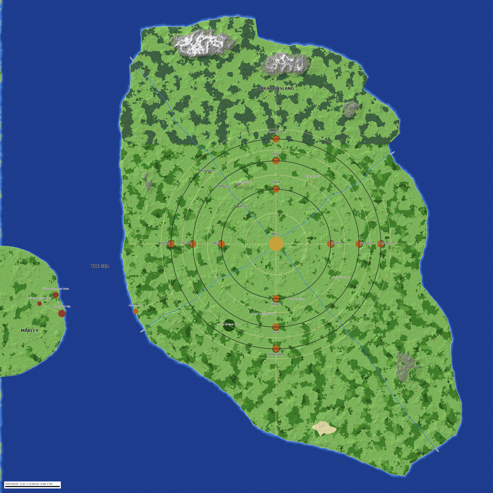
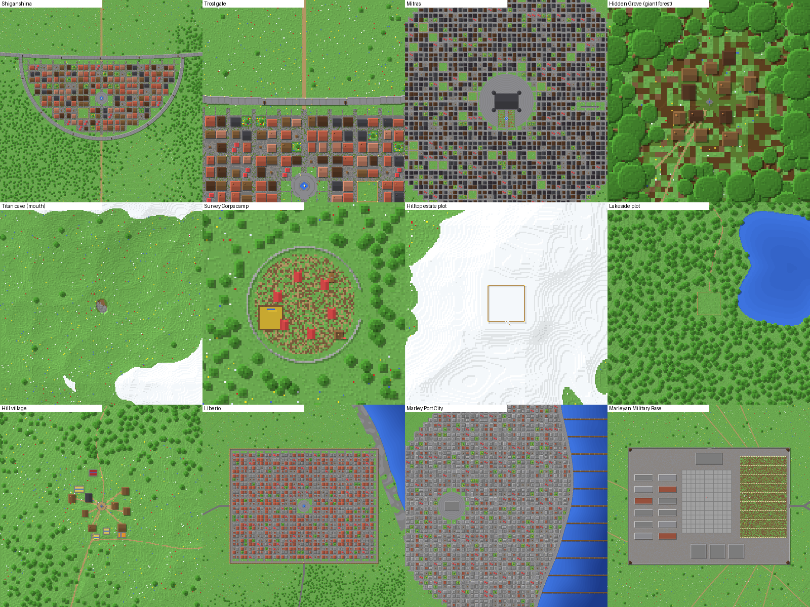

# Attack on Titan: Paradis & Marley map generator

A standalone generator that writes a finished **Minecraft Java 1.21.1** world with
Paradis Island and the Marleyan coast. It's built as the base for a Wynncraft-style
open-world RPG. The output is a normal world folder that works in singleplayer and on
Fabric, Forge, NeoForge or vanilla servers. It's designed to sit alongside an AoT
modpack such as Danny's AOT, which supplies the titans and ODM gear.



## Scale and travel times

The map is sized for travel on horseback. An average horse covers about 8 blocks/s
once hills and bends are counted.

| Trip | Distance | Time |
|---|---|---|
| Paradis, north tip to south tip | ~19,000 blocks | ~40 min on horseback |
| Paradis, east to west | ~12,500 blocks | ~25 min |
| Paradis Port → Marley Port City | ~4,500 blocks of sea | ~10 min by boat |
| Across Marley's coast | ~4,000 × 9,000 blocks | ~8–10 min |
| Wall Maria (radius 3,360) | Shiganshina → Trost ~700 blocks | ~1.5 min |

The Walls are 7 blocks per canon km (about 1:140) and keep their true 50-block height.
The land outside Wall Maria follows the traced reference map, squashed to hit the 40
minute target. Both are adjustable: see [Options](#options).

## What's in the world

- **The three Walls:** walkways, cannons, iron portcullis gates, scaffolding lifts
  (hold jump to ride up) and water gates for rivers.
- **12 districts:** Shiganshina, Trost, Karanes, Stohess, Ehrmich and the rest. Each
  is a walled half-circle town with streets, a plaza, markets and fenced town plots.
- **Mitras:** the palace and noble estates, plus the Underground City beneath it.
- **Landmarks:** the Forest of Giant Trees, Utgard Castle, Reiss Chapel and its
  crystal cavern, Survey Corps HQ, the cadet training camp, Ragako and Paradis Port
  (stone quay, piers, lighthouse).
- **About 100 villages of several types:**
  - farming villages with fields
  - hill villages terraced into slopes, with stepped gardens
  - forest cabin villages
  - fishing villages with docks
  - Marleyan brick hamlets
- **The Forest of Giant Trees:**
  - the Canopy Hideout: decks 30 blocks up the giant trees, joined by rope bridges,
    with cabins built around the trunks and a scaffolding lift up
  - the Hidden Grove: a secluded village in a clearing, reached by a faint path
- **Wilderness:** bigger hills outside the walls, stepped hillsides, snowy northern
  peaks, about 40 lakes, rivers, the Sand Barrens, and coasts that mix beaches,
  stony shores and sea cliffs.
- **Roads:** ring roads and gate roads as main highways with lamp posts, and paved
  roads in Marley. Winding trails link villages to each other and to the highways, and
  footpaths lead to plots and hideouts. Roads are graded into the slopes, bridge
  rivers and lakes, and enter walled places through their gates.
- **Marley:** the walled Liberio Internment Zone, Marley Port City with the military
  HQ and a quay, and the Marleyan Military Base (barracks, HQ, parade ground, depots,
  training field).



### Life in the world

- **Animals:**
  - herds of horses, cows, sheep, pigs and donkeys graze the plains and meadows
  - rabbits, foxes and goats live in the forests and hills
  - villages keep fenced pastures, pig pens, chicken coops and horse paddocks
  - Survey Corps HQ, the training camp, expedition-camp corrals and town stables all have horses
- **People:** kept deliberately few, with nothing wandering or lagging:
  - Stable Masters (below) stand still
  - an occasional resident stays inside a home
  - travellers walk the roads near players (see the titan datapack below)
  - cats and chickens live in town gardens
- **Furnished interiors, sized to the building:**
  - homes get kitchens, dining tables, bedrooms, storage, studies and sitting corners
  - halls, HQs and the palace get long dining tables, libraries and lounges
  - barracks get bunks and armouries; stables get hay, water and horses
  - walkways are left clear between rooms
- **Stable Masters (horse vendors):** every district town, Mitras, both ports and
  Liberio have a signposted stable near the plaza. Every farm village, Survey Corps HQ,
  the training camp and the Marleyan base also have one. `/function aot:stables` lists
  them all and warps you there when you click one. They trade for emeralds:

  | Item | Price | Stats |
  |---|---|---|
  | Common Horse | 10 emeralds | speed 0.20, jump 0.6, 20 HP |
  | Swift Courser | 24 emeralds | speed 0.30, jump 0.8, 26 HP |
  | Survey Corps Warhorse | 48 emeralds + 1 diamond | speed 0.3375 (vanilla max), jump 1.0, 30 HP |
  | Pack Donkey | 12 emeralds | — |
  | Saddle / leads / hay / iron, gold and diamond horse armour | 1–32 emeralds | — |

  Horses and donkeys come as tamed spawn eggs. Stable Masters stand still and can't be
  hurt.
- **Waterfronts:** harbour towns have a paved promenade with sea-facing benches,
  planters and lamps. Buildings are only placed where they fit completely, so nothing
  is ever cut off at a coast or town edge.
- **Trees:** trees keep clear of every road and path. Forests are a little taller, and
  open groves of big, widely spaced trees give ODM gear room to swing.

### Missions: titan caves and Survey Corps camps

- **About 25 titan caves.** Each is a hillside cave mouth leading down to a great hall
  about 30 blocks tall, sized for titans, with a titan's bone ribcage and two side
  chambers. Loot chests use vanilla dungeon, mineshaft and pyramid loot. Every cave
  is its own named zone (e.g. *The Titan's Throat*) with a level range and a warp.
- **About 20 Survey Corps expedition camps:** a palisade, tents, a supply wagon with a
  loot chest, a horse corral, a watchtower with a lift, and a flag. Three camps ring
  the Forest of Giant Trees.
- **Smaller finds:** ruined watchtowers on hilltops, campsites, stone circles, hermit
  cabins and shipwrecks with treasure.

All of them are listed with coordinates and levels in `missions.csv` in the world
folder.

### Property plots for player housing

There are about **530 empty plots** across the map, each fenced and levelled, with a
gate facing its driveway and a numbered sign (`Property #123`). Sizes:

| Size | Interior | Where |
|---|---|---|
| Small | 14 × 14 | village edges, forests, meadows |
| Medium | 20 × 20 | villages, lakesides, coasts, forest clearings |
| Large | 28 × 28 | meadows, lakesides, mountainsides, hilltops |
| Estate | 36 × 36 | secluded hilltops (mansions) |
| Town | 23 × 23 | whole city blocks inside the districts and Mitras |
| Treehouse | 13 × 13 deck | the Canopy Hideout, 30 blocks up |

`plots.csv` and `plots.json` in the world folder list every plot: id, type, size,
buildable interior corners, floor height, gate side and zone. A housing plugin or mod
can paste a house schematic or instance straight onto a plot from that list.

## Generating the world

You need Java 17 or newer (the Java bundled with Minecraft 1.21 works, or get it from
https://adoptium.net).

1. Download `dist/aot-world.jar` and `dist/generate-world.bat` (or `.sh`) into one folder.
2. Double-click `generate-world.bat`, or run:
   ```
   java -Xmx4G -jar aot-world.jar generate AttackOnTitan
   ```
3. Copy the `AttackOnTitan` folder into your instance's `saves` folder. On a Fabric
   server, set `level-name=AttackOnTitan` instead.
4. You spawn in Shiganshina.

The full map is about 900k chunks, roughly **3.6 GB**. It takes about 15–20 minutes
on a 4-core CPU. Open sea far from land isn't written; the game fills it with
matching flat ocean.

To try a small piece first (a few seconds):

```
java -jar aot-world.jar generate TestWorld --place shiganshina-district --radius 800
```

### Options

| Option | Meaning |
|---|---|
| `--island-length 19000` | Paradis north-to-south length in blocks, about 40 min on horseback. Lower it for a quicker map. |
| `--scale 7` | Size of the Walls in blocks per canon km. 7 ≈ 1:140 (default), 20 = canon 1:50. |
| `--island-scale <f>` | Set the outer-island squash directly instead of `--island-length`. |
| `--place <id>` / `--radius <n>` | Generate only around a place (ids come from `places`). |
| `--area x0,z0,x1,z1` | Generate only a rectangle. |
| `--threads <n>` / `--seed <n>` | Worker threads / terrain seed. |

## Places and warps

`java -jar aot-world.jar places` lists every zone with its levels and coordinates:
districts, landmarks, each titan cave and camp, the Hidden Grove and the Canopy
Hideout. The world also includes a datapack:

- `/function aot:places` shows a clickable list of zones.
- `/function aot:warp/<id>` teleports you, e.g. `/function aot:warp/the-titan-s-throat`.

Level ranges are metadata for server design; nothing enforces them in-game. Titans
come from your AoT mod.

## Titans from your AoT mod

AoT mods such as Danny's AOT usually spawn their titans only in their own dimension.
This tool adds a datapack (`aot_titans`) that makes titans the only monsters in this
map:

- **No vanilla monsters.** Zombies, creepers, endermen, phantoms, patrols and so on
  are turned off. Horses, donkeys and farm animals are spawned by the pack instead.
- **Titans by day** in Wall Maria territory, the wilds outside the walls and the
  Forest of Giant Trees. They only ever appear on solid ground (never on treetops) and
  come in three patterns:
  - **lone drifters**
  - **packs** of 2–5 bunched together
  - **waves**: a group appears 50–80 blocks out in one direction, with a bell, a roar
    and a "Titans approaching!" warning, then marches on the player until it's close.
    Waves come a few minutes apart for anyone outside the walls.
- **Titans fill the land around every player, even players in a safe zone.** Where a
  titan may appear depends on the spot, not on where the player stands. So from a
  wall, gate or town you can watch titans roaming the wilds, and they're already out
  there when you ride out.
- **Safe zones:** inside Wall Rose, every district town, Paradis Port, the Hidden
  Grove, the sea and Marley. An admin can override this with a Wall breach event.

### Setup (Windows, drag and drop)

1. Put `aot-world.jar`, `scan-mod.bat` and `add-titans.bat` from `dist/` in one folder.
2. Drag the mod's jar (instance *⋮ → Open folder → mods*) onto `scan-mod.bat`. This
   lists the mod's entities and writes `titans.txt`.
3. Edit `titans.txt`: keep the titans you want and remove shifters and friendly NPCs.
   The file only lists titans; spawn rates use the defaults below.
   Each line is `<zone> <entity id> <weight>`. Zones:
   - `maria` for Wall Maria territory
   - `wild` for outside the walls
   - `any` for both
4. Drag your world folder (instance *saves*) onto `add-titans.bat`, then `/reload`
   in-game.

The same from a terminal: `java -jar aot-world.jar scan-mod <mod.jar>` and
`java -jar aot-world.jar titans <world> --config titans.txt`.

### Optional settings in `titans.txt`

Add any of these lines to override the defaults:

| Setting | Default | Meaning |
|---|---|---|
| `interval` | 5 | Seconds between spawn attempts per player |
| `chance` | 85 | Percent chance per attempt |
| `cap` | 20 | Most titans near a player (waves ignore it) |
| `radius` | 160 | How far away titans can appear (never closer than 30) |
| `pack_chance` | 40 | Percent of spawns that are packs rather than lone titans |
| `wave_minutes` / `wave_size` | 4 / 7 | How often waves come, and how big they are |
| `vanilla_mobs` | off | `on` keeps vanilla monsters |
| `animals` | on | `animal <id> <weight>` lines replace the default animal list |
| `travellers` | on | People walking the roads near players |

### Commands in-game

| Command | What it does |
|---|---|
| `/function aot_titans:status` | Shows your zone (0 safe, 1 Wall Maria, 2 wilds), titans near you, and whether spawning is on |
| `/function aot_titans:test` | Spawns a pack 50–80 blocks from you right now (checks the titan ids work) |
| `/function aot_titans:on` / `off` | Toggles titan spawning |
| `/function aot_titans:event/breach_on` / `breach_off` | Wall breach: titans spawn inside Wall Rose and in the towns |
| `/function aot_titans:event/wave` | Sends a marching wave at every player, wherever they are |
| `/execute as <player> at @s run function aot_titans:event/horde` | A 12-titan horde at one player, anywhere |

Turning off vanilla spawning is a world gamerule (`doMobSpawning false`), so it also
stops natural spawning in the mod's own dimension while you're in this world.

## Running a server (server creator)

`create-server.bat` (Windows) builds a ready-to-run Fabric server in `AoT-Server` next to it:

1. `dist/aot-rpg.jar` (the RPG mod) is picked up automatically.
2. Double-click `create-server.bat` and answer the questions. You can drag the mods folder and the world folder into the window; paths with spaces are fine.
3. Accept the Minecraft EULA when asked. Then run `AoT-Server\start.bat`. The server needs Java 21.

What the creator does:
- Downloads the Fabric server for 1.21.1.
- Copies your mods, skipping client-only mods such as Sodium, Iris and EMF/ETF.
- Copies the world.
- Writes `server.properties`. It sets `allow-flight=true` so ODM gear doesn't get players kicked, and `spawn-protection=0`.

To make yourself operator, type `op <yourname>` in the server console. Players join with the same modpack.

On Linux or macOS: `./create-server.sh <mods folder> [world folder] [ram]`.

## AoT RPG server mod (`rpg-mod/`)

A Fabric 1.21.1 mod that runs on the server. It also works in single-player if it's in your mods folder. It is built by GitHub Actions and saved as `dist/aot-rpg.jar`. Put it in the server's `mods` folder. Also add it to the client modpack: with it players get the full AoT creator screen, the Character & Skills screen (K) and the RPG HUD (name, level, HP, stamina, XP in the top right). Players without it still work, with chest menus and an XP boss bar.

Character creation starts on a player's first join. The player is frozen and protected until they finish:
1. **Origin**: Shiganshina, Trost, Ragako, Stohess, Mitras or the Underground. Each gives a small bonus and sets where the character starts.
2. **Discipline**: Scout, Vanguard, Guardian, Marksman or Medic. Each has its own perks and starting gear.
3. **Stats**: spend 5 points on Strength, Agility, Endurance and Resolve.
4. **Name**: a first name (typed, or taken from your username) and a family name (rolled from AoT-style surnames, or typed).
5. **Enlist**: an intro sequence plays and you receive the cadet uniform, gear, emeralds and a Recruitment Letter pointing to the Cadet Training Camp. You're then sent to your origin town, which becomes your spawn point.

Progression:
- Killing titans gives XP. Players within 32 blocks get half as an assist.
- Levels run from 1 to 100, and each level gives 1 stat point.
- An XP bar at the top of the screen shows your level, name and discipline.

Name plates: with the client mod, players show an AoT-styled plate (character name, level, discipline) instead of the username tag, fading out beyond about 20 blocks. Party members further away get a small soft diamond over their head with their name and distance, visible through terrain and even beyond render distance. Party members' plates have a green trim (gold for the leader) and a health bar.

Minimap (top left, **Ctrl+M** toggles it): terrain around you (north up), your arrow, party members (green, gold for the leader; they stay pinned to the edge when far away), titans (large red) and hostile mobs (small red), and a gold marker for your current story objective. The objective text and distance sit under the map; party frames sit below that.

World map (**M**): a parchment map of the whole world with every area's name in its title colour and its level range above it; your position, party, quest markers and (zoomed in) campfires. Drag to pan, scroll to zoom, right-click to mark a spot (your party sees it; right-click it again to remove). The side panel tracks quests and highlights them for your whole party. The map image is made by the generator (`aot-map.png`) and sent to each player once, then cached.

Quest Journal (**J**): the main story plus side quests built from the map: explore towns and landmarks, report to Survey Corps camps, clear titan caves (5 titans), titan hunts (8 titans). Accept, abandon, track (shown under the minimap), highlight for the party, or show on the map. Rewards: XP, emeralds, and gas canisters from Danny's AoT mod for fights.

Waypoints: the tracked quest, your mark, party marks and party-highlighted quests show as bold light beams in the world, plus a semi-transparent floating icon with the name and distance that shows through terrain and fades as you arrive. On the minimap they are small diamonds, pinned to the edge when far away.

Starter kit: the cadet uniform (`dannys-aot:uniform`), ODM boots (`dannys-aot:odm_boots`), the ODM harness worn on the legs (`dannys-aot:odm_gear`), two grips (`dannys-aot:blade`, starting sheathed on the back), a gas canister, plus 16 Ice Burst clusters (`dannys-aot:ice_burst_cluster`) and 16 blade components in the satchel. `/aotrpg kit <player>` gives it again.

Supplies in the satchel: Ice Burst clusters (`dannys-aot:ice_burst_cluster`), blade components (`dannys-aot:blade_component`) and APG cartridges (`dannys-aot:apg_cartridge`) are kept in the satchel, and picked-up supplies are moved there. When you hold your grips (`blade` or the APG grips), a gas canister or the APG gun, one stack of each is brought out into your backpack rows (never the hotbar) so the AoT mod can use it (refilling the canister and so on). When you put the gear away they go back to the satchel.

Combat loadout (hotbar): every slot has a purpose and only takes what belongs there. The HUD splits it down the middle, with a combat wing and a support wing pointing in at the heal slot:

| Slot | For |
|---|---|
| 1 Melee | ODM gear grips, blades, swords, axes |
| 2 Ranged | APG gun, bows, crossbows, muskets, thunder spears |
| 3 Sidearm | a second weapon or a shield |
| 4 Tool | pickaxes, shovels, fishing rods, shears |
| **5 Heal** (centre) | provisions, campfire meals, golden apples, potions |
| 6 Mount | saddle, lead, horse armor, horse treats |
| 7 Signal | flare gun and flares, torches, spyglass, maps |
| 8, 9 Free | anything |

Items only go where they belong. Misplaced ones move to your backpack, and nothing is equipped for you. Empty slots show a faint picture of what goes there; hover one in the inventory for a hint. Creative mode is not restricted.

**Quick heal (H)** uses the heal slot, or your best heal from the inventory or satchel when it's empty. It works instantly on an 8 second cooldown, and food mends a little health on top of the hunger it restores.

**ODM sheath (G):** the two ODM grips (the `blade` handles, or the APG grips) are a set. **G** sheathes both on your back (they show crossed there for everyone) and draws them again into slot 1 and your off hand. Whatever you had in your off hand is kept aside and comes back when you sheathe. New characters start with both grips sheathed. The HUD shows DRAWN or SHEATHED next to the hotbar.

Inventory: the character panel is a Baldur's Gate style loadout built from the real hotbar slots: Melee (slot 1 and the off hand) and Ranged (slots 2 and 3) around your armor shield, then Tool, Heal and Mount, then Signal and the two free slots. Your stats sit where the hotbar row used to be. With the recipe book open the slots go back to the normal hotbar row.

**Food is RPG food:** ready-to-eat food from loot, mob drops, trades or crafting (bread, cooked meat, pies, stews...) becomes a named provision as soon as it reaches your inventory or satchel. Provisions heal with H just like campfire meals. Raw meat, fish and vegetables are cooking ingredients. The starter kit has Survey Corps Rations and Field Bread.

Social wheel (hold **Left Alt**, point, release): Party (members, leave or disband, one-click invites for players within 48 blocks), Emote (coming soon), Trade (coming soon), Cosmetics, and two reserved slots.

Cosmetics are looks only, never power. Bullet trails for Danny's APG gun: Tracer (free), Ember, Frost, Thunder, Rainbow, Confetti, Hearts, Void. Trails appear when you left-click (fire) with the APG gun; everyone within 128 blocks sees the shooter's trail. Operators have everything unlocked. Operator commands:
- `/aotrpg cosmetics allow|disallow <player>`: the allowlist (everything unlocked).
- `/aotrpg cosmetics grant|revoke <player> <id|all>`: single cosmetics.
- `/aotrpg cosmetics list <player>`.
Saved in `<world>/aot_rpg/cosmetics.json`.

Pause menu: AoT style, with shortcuts to Character & Skills, Journal, Map, Satchel, Options and Mods.

Safe areas: titans that wander inside Wall Rose, into a district, Mitras, the Training Camp, Survey Corps HQ, Ragako, Reiss Chapel or the port are removed (not during a wall breach event; the Nine Titans are never touched).

Danny's AoT items: the mod finds the AoT mod's items when the server starts (ODM gear, blades and gas go into the starter kit) and lists them all in `<world>/aot_rpg/aot-items.txt` (`/aotrpg items` refreshes it).

Inventory: the survival inventory uses the AoT style, with a character panel on the left (large player viewer, health, armor, damage, speed, stamina).

Satchel (**B**, or the button in your inventory): 36 slots for story items and supplies: anything edible, cooking ingredients, fishing catches. It is saved separately and **never lost on death**. Story items (like the Recruitment Letter) live only in the satchel.

Cooking: right-click a lit campfire with an empty hand (or while sneaking) to open the cooking screen. Recipes use ingredients from your satchel first, then your inventory, and meals go into the satchel. Meals restore hunger and give timed buffs:

| Meal | Ingredients | Buffs |
|---|---|---|
| Roast Meat Skewer | 1 raw meat | Strength I 2m |
| Grilled Fish | 1 raw fish | Regeneration 15s, Water Breathing 2m |
| Hearty Stew | 1 raw meat, 2 vegetables | Resistance I 4m, Regeneration 10s |
| Fisherman's Soup | 2 raw fish, 1 vegetable | Haste I 4m, Water Breathing 4m |
| Survey Corps Ration | 3 wheat, 1 raw meat | Speed I 5m |
| Honey Cake | 2 wheat, 1 sweetener, 1 egg | Jump Boost I 3m, Absorption I 2m |
| Mushroom Broth | 2 mushrooms | Night Vision 5m |

Cooking fires: every camp, hermit's cabin and a new roadside **Rest Stop** (about every 650 blocks of road) has a campfire; they show as orange dots on the minimap. Operators can add more with `/aotrpg campfire`.

Hunger: at 6 food or less you deal 15% less damage and move 10% slower; at 2 or less it is 30% and 20%. The HUD food bar flashes and shows HUNGRY or STARVING.

Death: in **story mode** (the default) you keep your gear and inventory. Worn gear loses 10% durability and you lose 10% of your current level's XP. In **extraction mode** (`/aotrpg mode <player> extraction`, meant for extraction game modes) items drop as usual. The satchel is safe in every mode. The death screen shows what happened and what you kept.

Story: Chapter 1 has you report to the Cadet Training Camp, then slay 3 titans beyond the walls; Chapter 2 sends you to the Survey Corps HQ. Each objective gives XP. More chapters are coming.

Protected land and regeneration: players cannot break or place blocks anywhere in the overworld (Paradis, the walls, Marley). Buckets, fire, tilling and stripping, and knocking down item frames, paintings or armor stands are blocked too. Operators in creative mode can always build. When there's a building island, mark it with a build zone. Build zones are open to everyone and never regenerate.

Anything else that destroys blocks (titans, explosions, fire, mobs) is remembered. The blocks are put back after 5 minutes, bottom up, only when no player is within 12 blocks, and never on top of something new. Changes made by commands (`/fill`, `/setblock`, building tools) and by operators breaking blocks are permanent. Waiting blocks survive restarts (`<world>/aot_rpg/regen.nbt`). Settings are in `<world>/aot_rpg/protection.json`.
- `/aotrpg protect on|off`, `/aotrpg protect zone add <name> <x1> <z1> <x2> <z2>`, `/aotrpg protect zone remove <name>`, `/aotrpg protect zone list`.
- `/aotrpg regen on|off`, `/aotrpg regen delay <seconds>`, `/aotrpg regen now` (restore everything loaded right away), `/aotrpg regen forget` (keep the current damage), `/aotrpg regen status`.

Commands:
- `/character` or **K**: character sheet and skill tree. Spend stat points and skill points here.

Skills: three branches (Blade, Mobility, Survival) of four skills, unlocked at levels 1/10/20/35. You get 1 skill point at enlistment and 1 more every 5 levels.

Stamina: sprinting and attacking drain it and resting refills it. At zero you are exhausted: no sprinting and slowed until it recovers. Endurance and some skills raise it.
- `/character reset`: delete your own character and create a new one (asks you to confirm; no second starter kit).
- `/aotrpg mode <player> story|extraction`, `/aotrpg campfire` (place a cooking fire here).
- `/aotrpg reset [player]` (no name = yourself), `/aotrpg setlevel <player> <level>`, `/aotrpg xp <player> <amount>`, `/aotrpg reload` (operators).

Parties (up to 6 players):
- `/party invite <player>` sends an invite with clickable [Accept] and [Decline] buttons; it expires after 60 seconds.
- `/party accept [player]`, `/party decline`, `/party leave`, `/party list` (or just `/party`).
- The leader can use `/party kick <player>`, `/party leader <player>` and `/party disband`.
- `/pc <message>` (or `/party chat <message>`) talks to your party only.
- Party members can't hurt each other. They share 60% of titan XP within 64 blocks; other players within 32 blocks get an assist.
- With the client mod, party frames appear on the left of the screen: name, level, discipline, HP, stamina, and distance with a direction arrow. Party members are outlined through walls, green (gold for the leader). Only you see your party's outlines.
- Parties are kept in memory and end when the server restarts.

Character data is saved in `<world>/aot_rpg/players/`. Place coordinates come from `<world>/aot-rpg.json`, which the generator writes. Running `add-titans.bat` on an older world adds it.

## Previews without Minecraft

```
java -jar aot-world.jar preview overview map.png             # whole world
java -jar aot-world.jar preview detail trost.png 0 2660 400  # 400x400 blocks around (0, 2660)
```

## Customising

- **Geography:** `src/main/java/com/pglol/aotworld/core/Atlas.java` (districts,
  landmarks, level ranges, mountains, rivers, the traced Paradis outline).
- **Layout of everything scattered:** `core/AotWorld.java`, `Scatter.java` and
  `Villages.java` (villages, plots, caves, camps, lakes, trails).
- **Buildings:** `core/build/`.

Build with `mvn package`.

## How it works

The core is pure Java with no Minecraft dependency. When the tool starts, it lays the
whole map out in about half a second: geography, then roads, villages, trails, the
forest, lakes, points of interest, plots and driveways. It then records the levelled
ground each of them needs. After that, every block is a deterministic function of its
coordinates, so chunks are generated independently and in parallel. They're written
as Anvil region files (DataVersion 3955) together with `level.dat`, the datapack and
the plot and mission lists. Lighting is computed by the game on first load.
