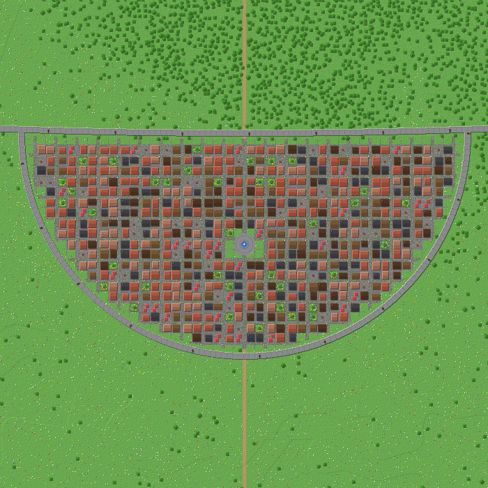
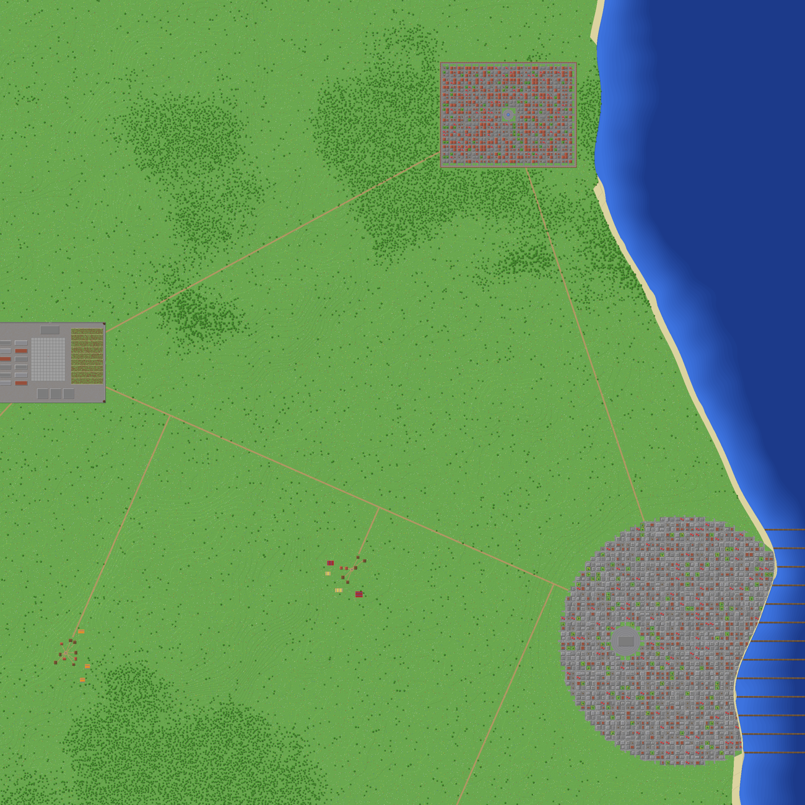
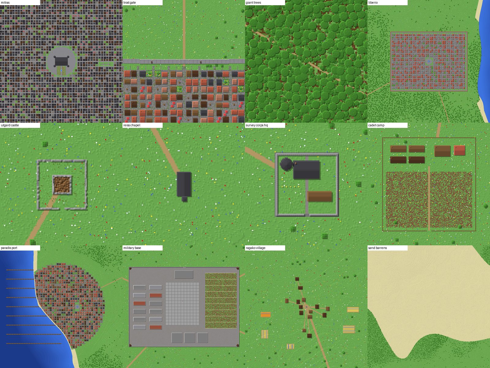

# Attack on Titan: Paradis & Marley map generator

A standalone generator that writes a finished **Minecraft Java 1.21.1** world with
Paradis Island and the Marleyan coast. It's built to be the base of a Wynncraft-style
open-world RPG. The output is a normal world folder. It works in singleplayer and on
Fabric, Forge, NeoForge or vanilla servers, and doesn't depend on any mod. It's
designed to run alongside a modpack such as Danny's AOT, which supplies the titans and
ODM gear.


## What's in the world

- **The three Walls** at canon scale: 50 blocks tall and 9 thick, with radii of 5,000 /
  7,600 / 9,600 blocks at 1:50 (Wall Sina 250 km, Rose 380 km, Maria 480 km). Each wall
  has a walkway, crenellations, cannons, iron portcullis gates, scaffolding lift shafts
  (hold jump to ride up) and arched water gates where rivers pass under.
- **12 districts** bulging out from the walls, each a walled half-circle town of
  timber-frame houses with streets, plazas, fountains, markets, wells and gardens:
  Shiganshina, Trost, Karanes, Krolva, Utopia, Stohess, Ehrmich, Yalkell, Orvud,
  Quinta, plus two fan-named Maria districts.
- **Mitras**, the royal capital: stone mansions, the royal palace with four towers and
  gardens, and a stairway down to the **Underground City**, a lit cavern town under the
  capital.
- **Landmarks:** Forest of Giant Trees (80–90-block trees with branches for ODM), Utgard
  Castle ruins, Reiss Chapel with the crystal cavern beneath it, Survey Corps HQ, the
  104th Cadet Corps training camp, Ragako Village and Paradis Port with piers and a
  lighthouse.
- **Paradis Island** shaped after the reference map: snowy northern mountains, eastern
  and south-eastern hills, the southern Sand Barrens, rivers, forests, ring roads, and
  about 200 procedurally placed farming villages with fields.
- **Marley**, only the part needed for quests and fights: the walled **Liberio
  Internment Zone**, **Marley Port City** with the military headquarters and piers, and
  the **Marleyan Military Base** (barracks, HQ, parade ground, depots, training field,
  watchtowers). They're linked by roads across the sea from Paradis Port.
- **Level zones** from Lv 1 at Shiganshina to Lv 85 at the Marleyan base. Each zone has
  a warp. See [Places and warps](#places-and-warps).

| | |
|---|---|
|  |  |



## Generating the world

You need Java 17 or newer (the Java that ships with Minecraft 1.21 works, or install it
from https://adoptium.net).

1. Download `dist/aot-world.jar` and `dist/generate-world.bat` (or `generate-world.sh`)
   into the same folder.
2. Double-click `generate-world.bat`, or run:
   ```
   java -Xmx4G -jar aot-world.jar generate AttackOnTitan
   ```
3. Copy the `AttackOnTitan` folder into your instance's `saves` folder. In the Modrinth
   App that's the instance's *Files → saves* folder. For a Fabric server, put it next to
   the server jar and set `level-name=AttackOnTitan` in `server.properties`.
4. Open the world. You spawn in Shiganshina's plaza.

The full map is about 4.1 million chunks (roughly 16 GB on disk). It takes about 45
minutes on a 4-core CPU and about 20 minutes on 8 cores. Open sea far from land isn't
written: the world uses a flat-ocean generator there, so it still looks like ocean.

### Try a small piece first

```
java -jar aot-world.jar generate TestWorld --place shiganshina-district --radius 800
```

This generates in a few seconds, and the world border is set to the generated area.

### Options

| Option | Meaning |
|---|---|
| `--scale 20` | Blocks per canon km. 20 = 1:50 (default), 10 = 1:100 (the map becomes a quarter the area). |
| `--island-scale 0.35` | Squash applied to the land outside Wall Maria. 1.0 makes Paradis as big relative to the walls as on the reference map (about 77k blocks tall). |
| `--place <id>` / `--radius <n>` | Generate only around a place (ids come from `places`). |
| `--area x0,z0,x1,z1` | Generate only a rectangle. |
| `--threads <n>` | Worker threads (default: all cores). |
| `--seed <n>` | Changes terrain noise, villages and river meanders. The layout stays the same. |

## Places and warps

`java -jar aot-world.jar places` lists every zone with its level range and coordinates.
The generator also writes:

- `aot-places.txt` in the world folder, a list of every zone with coordinates.
- a datapack with clickable fast travel: `/function aot:places` lists the zones and
  `/function aot:warp/<id>` teleports you, e.g. `/function aot:warp/trost-district`.

Level ranges are metadata for your server design; nothing enforces them in-game. Titans
come from your AoT mod and follow that mod's spawn rules.

## Previews without Minecraft

```
java -jar aot-world.jar preview overview map.png            # whole world, 16 blocks per pixel
java -jar aot-world.jar preview detail trost.png 0 7600 600  # 600x600 blocks around (0, 7600)
```

## Customising

All geography lives in `src/main/java/com/pglol/aotworld/core/Atlas.java`: district
names, landmark positions, level ranges, mountain ranges, rivers and the traced Paradis
outline. Buildings are in `core/build/` (`House`, `TownGrid`, `WallFeature`,
`Landmarks`, `CapitalFeature`). Build with `mvn package`. The jar lands in `target/`.

## How it works

The core (`core/`) is pure Java with no Minecraft dependency. Every block is a
deterministic function of its coordinates, so any chunk can be generated on its own and
in parallel. `anvil/` serialises chunks to Anvil region files (DataVersion 3955) and
writes `level.dat`. Lighting and heightmaps are left for the game to compute on first
load, so the first visit to an area can take a moment longer.
